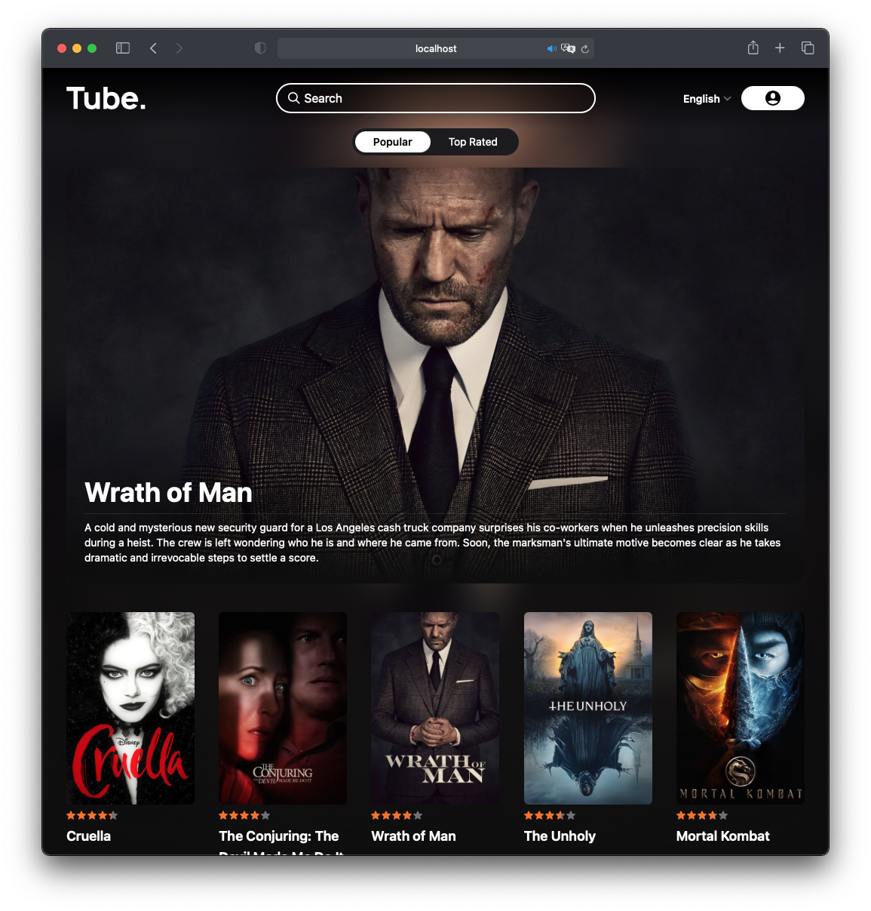
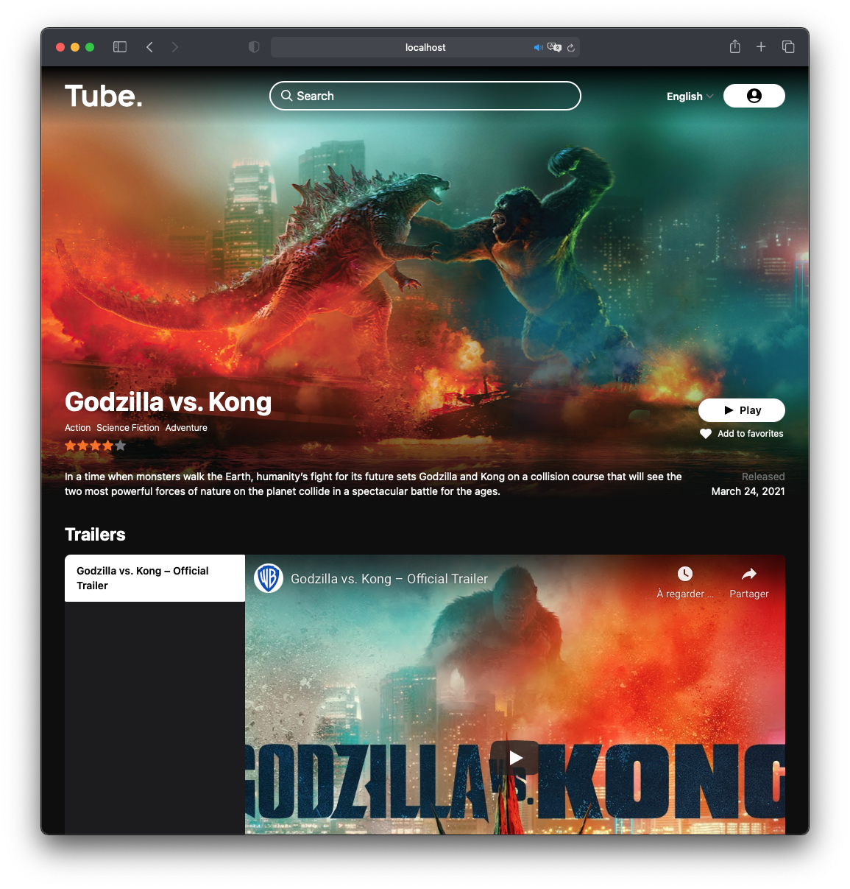

# Hypertube




## Introduction

Hypetube is a movie streaming web app project at the 42 school. User can browse and view details from popular and top rated movies from the [TMDB API](https://www.themoviedb.org). They can watch the movie torrent coming from [YTS](yts.mx) with a hand crafted player.

## Installation

You can install Hypertube very easily by executing the following command at the root of the folder:

```bash
docker-compose up
```

## Technologies

This project is made entirely using [Typescript](https://www.typescriptlang.org) which dramatically improves Javascript.

The frontend is made using [Svelte](https://svelte.dev) which brings simplified observation pattern and cool animations features that makes the app feels more alive. We also used [Tailwind css](https://tailwindcss.com) that simplify the design process by bringing pre-builded class to html elements.

The backend part is made using [NestJS](https://nestjs.com) that made events handling from the frontend very easy. We used [GraphQL](https://graphql.org) for the request format.

## Features

### UI

- Carefully crafted user interface.
- Intuitive and animated user interface.
- Responsive user interface.

### Movies

- Browse popular and top rated movies forever with the infinite scrolling.
- Watch the beautiful large images of a movie in the detail movie section.
- Browse and watch the trailers of a movie in a second from the movie page.
- Get the director and actor list of a movie.
- Get recommandations from a movie.
- Search movies from anywhere and order your results with filters.

### Player

- Beautiful hand made player that fits the whole screen.
- Animated controls that react to your mouse.
